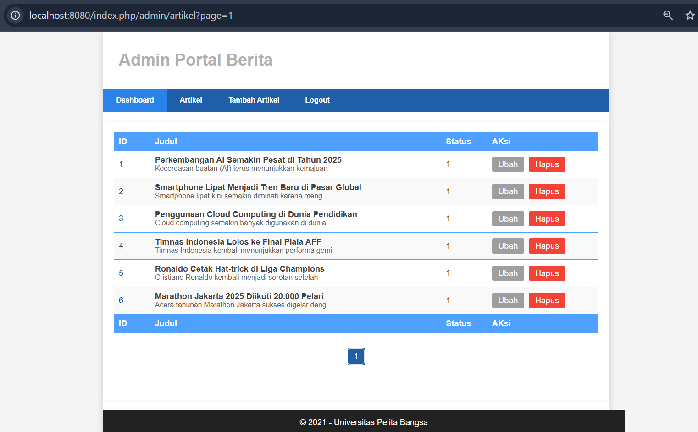

<<<<<<< HEAD
# Praktikum ke 4 - 6

<p align='center'>
    
    
</p>

## Profil

|                 |                        |
| --------------- | ---------------------- |
| **Nama**        | Muhammad Nurul Firdaus |
| **Kelas**       | TI.23.A.5              |
| **Mata Kuliah** | Pemrograman Web 2      |

## Langkah-langkah Praktikum

### **Praktikum 4: Membuat Sistem Login**

#### 1. Persiapkan Database

Buat tabel `user` pada database dengan SQL berikut:

```sql
=======
# PRAKTIKUM 4-6


## Profil
| Nama | Kelas | NIM | Mata Kuliah | Dosen |
|------|-------|-----|-------------|-------|
| LUTPIAH AINUS SHIDDIK    |  TI.23.A.5     | 312310474    |    Pemograman web 2         |  Agung Nugroho, S.Kom., M.Kom.     |

# Praktikum 4: Framework Lanjutan (Modul Login)

# Langkah-langkah Praktikum

Untuk memulai membuat modul Login, yang perlu disiapkan adalah database server menggunakan MySQL. Pastikan MySQL Server sudah dapat dijalankan melalui XAMPP.

# 1. Persiapkan Database
Buat tabel user pada database dengan SQL berikut:

```
>>>>>>> 2b7983f5463ef7c9e16aedb07d2b409bcce3bb5c
CREATE TABLE user (
  id INT(11) auto_increment,
  username VARCHAR(200) NOT NULL,
  useremail VARCHAR(200),
  userpassword VARCHAR(200),
  PRIMARY KEY(id)
);
```
<<<<<<< HEAD


#### 2. Membuat Model User

Buat model `UserModel.php` pada direktori `app/Models`:
=======


# 2. Membuat Model User
Selanjutnya adalah membuat Model untuk memproses data Login. Buat file baru pada direktori app/Models dengan nama UserModel.php
>>>>>>> 2b7983f5463ef7c9e16aedb07d2b409bcce3bb5c

```php
<?php
namespace App\Models;
use CodeIgniter\Model;

class UserModel extends Model
{
    protected $table = 'user';
    protected $primaryKey = 'id';
    protected $useAutoIncrement = true;
    protected $allowedFields = ['username', 'useremail', 'userpassword'];
}
```

<<<<<<< HEAD
#### 3. Membuat Controller User

Buat controller `User.php` dengan method `index()` dan `login()` untuk mengelola user dan login:
=======
# 3.Membuat Controller User
Buat Controller baru dengan nama User.php pada direktori app/Controllers.

Kemudian tambahkan method index() untuk menampilkan daftar user, dan method login() untuk proses login.
>>>>>>> 2b7983f5463ef7c9e16aedb07d2b409bcce3bb5c

```php
<?php

namespace App\Controllers;

use App\Models\UserModel;

class User extends BaseController
{
    public function index()
    {
        $title = 'Daftar User';
        $model = new UserModel();
        $users = $model->findAll();
        return view('user/index', compact('users', 'title'));
    }
    public function login()
    {
        helper(['form']);
        $email = $this->request->getPost('email');
        $password = $this->request->getPost('password');
        if (!$email)
        {
        return view('user/login');
        }

        $session = session();
        $model = new UserModel();
        $login = $model->where('useremail', $email)->first();
        if ($login)
        {
            $pass = $login['userpassword'];
            if (password_verify($password, $pass))
            {
                $login_data = [
                'user_id' => $login['id'],
                'user_name' => $login['username'],
                'user_email' => $login['useremail'],
                'logged_in' => TRUE,
                ];

                $session->set($login_data);
                return redirect('admin/artikel');
            }
            else
            {
                $session->setFlashdata("flash_msg", "Password salah.");
                return redirect()->to('/user/login');
            }
        }
        else
        {
            $session->setFlashdata("flash_msg", "email tidak terdaftar.");
            return redirect()->to('/user/login');
        }
    }
}
```

<<<<<<< HEAD
#### 4. Membuat View Login

Buat view `login.php` untuk form login:
=======
# 4. Membuat View Login
Buat direktori baru dengan nama user pada direktori app/views, kemudian buat file baru dengan nama login.php.
>>>>>>> 2b7983f5463ef7c9e16aedb07d2b409bcce3bb5c

```html
<!DOCTYPE html>
<html lang="en">
	<head>
		<meta charset="UTF-8" />
		<title>Login</title>
		<link rel="stylesheet" href="<?= base_url('/style.css'); ?>" />
	</head>

	<body>
		<div id="login-wrapper">
			<h1>Sign In</h1>
			<?php if (session()->getFlashdata('flash_msg')): ?>
			<div class="alert alert-danger">
				<?= session()->getFlashdata('flash_msg') ?>
			</div>
			<?php endif; ?>
			<form action="" method="post">
				<div class="mb-3">
					<label for="InputForEmail" class="form-label">Email address</label>
					<input
						type="email"
						name="email"
						class="form-control"
						id="InputForEmail"
						value="<?= set_value('email') ?>"
					/>
				</div>
				<div class="mb-3">
					<label for="InputForPassword" class="form-label">Password</label>

					<input
						type="password"
						name="password"
						class="form-control"
						id="InputForPassword"
					/>
				</div>
				<button type="submit" class="btn btn-primary">Login</button>
			</form>
		</div>
	</body>
</html>
```
<<<<<<< HEAD

#### 5. Membuat Database Seeder

Database seeder digunakan untuk membuat data dummy. Untuk keperluan ujicoba modul login, kita perlu memasukkan data user dan password kedaalam database. Untuk itu buat database seeder untuk tabel user. Buka CLI, kemudian tulis perintah berikut:

```php
=======
# 5. Membuat Seeder untuk Database

Seeder database berfungsi untuk mengisi data awal atau data percobaan. Dalam rangka pengujian modul login, kita perlu menambahkan data akun pengguna beserta kata sandinya ke dalam tabel user. Untuk itu, kita perlu membuat seeder khusus untuk tabel user. Buka Command Line Interface (CLI), lalu jalankan perintah berikut:

```
>>>>>>> 2b7983f5463ef7c9e16aedb07d2b409bcce3bb5c
php spark make:seeder UserSeeder
```

Selanjutnya, buka file UserSeeder.php yang berada di lokasi direktori/app/Database/Seeds/UserSeeder.php kemudian isi dengan kode berikut:

```php
<?php

namespace App\Database\Seeds;

use CodeIgniter\Database\Seeder;

class UserSeeder extends Seeder
{
    public function run()
    {
        $model = model('UserModel');
        $model->insert([
            'username' => 'admin',
            'useremail' => 'admin@email.com',
            'userpassword' => password_hash('admin123', PASSWORD_DEFAULT),
        ]);
    }
}
```

Selanjutnya buka kembali CLI dan ketik perintah berikut:

<<<<<<< HEAD
```php
php spark db:seed UserSeeder
```

#### Uji Coba Login


#### 6. Membuat Filter Auth

Buat filter `Auth.php` untuk membatasi akses ke halaman admin:
=======
```
php spark db:seed UserSeeder
```

# *uji coba login*


# 6. Menambahkan Auth Filter
Selanjutnya membuat filer untuk halaman admin. Buat file baru dengan nama Auth.php pada direktori app/Filters.
>>>>>>> 2b7983f5463ef7c9e16aedb07d2b409bcce3bb5c

```php
<?php namespace App\Filters;

use CodeIgniter\HTTP\RequestInterface;
use CodeIgniter\HTTP\ResponseInterface;
use CodeIgniter\Filters\FilterInterface;

class Auth implements FilterInterface
{
    public function before(RequestInterface $request, $arguments = null)
    {
        // jika user belum login
        if (! session()->get('logged_in')) {
            // maka redirct ke halaman login
            return redirect()->to('/user/login');
        }
    }
    public function after(RequestInterface $request, ResponseInterface $response, $arguments = null)
    {
        // Do something here
    }
}
```

Selanjutnya buka file app/Config/Filters.php tambahkan kode berikut:

<<<<<<< HEAD
```php
'auth' => App\Filters\Auth::class
```


Selanjutnya buka file app/Config/Routes.php dan sesuaikan kodenya.


#### 7. Percobaan Akses Menu Admin

Buka url dengan alamat http://localhost:8080/admin/artikel ketika alamat tersebut diakses maka, akan dimuculkan halaman login.


#### 8. Fungsi Logout

Tambahkan method logout pada Controller User seperti berikut:

```php
=======
```
'auth' => App\Filters\Auth::class
```


Selanjutnya buka file app/Config/Routes.php dan sesuaikan kodenya.


# 7. Percobaan Akses Menu Admin
Buka url dengan alamat http://localhost:8080/admin/artikel ketika alamat tersebut diakses maka, akan dimuculkan halaman login.


# 8. Fungsi Logout
Tambahkan method logout pada Controller User seperti berikut:

```
>>>>>>> 2b7983f5463ef7c9e16aedb07d2b409bcce3bb5c
public function logout()
    {
        session()->destroy();
        return redirect()->to('/user/login');
    }
```

<<<<<<< HEAD
---

### **Praktikum 5: Pagination dan Pencarian**

#### 1. Membuat Pagination

Modifikasi controller artikel untuk menambahkan pagination:

```php
=======
# Praktikum 5: Pagination dan Pencarian

# Langkah-Langkah Praktikum
# 1. Menerapkan Pagination
Pagination adalah teknik yang digunakan untuk membatasi jumlah data yang ditampilkan dalam satu halaman pada sebuah situs web. Tujuannya adalah untuk membagi data dalam jumlah besar menjadi beberapa halaman agar tampilan menjadi lebih rapi dan mudah diakses.

Di CodeIgniter 4, fitur pagination sudah disediakan melalui Library bawaan, sehingga proses implementasinya cukup sederhana.

Untuk menerapkan pagination, silakan buka kembali Controller bernama Artikel, lalu lakukan penyesuaian pada method admin_index seperti contoh berikut:

```
>>>>>>> 2b7983f5463ef7c9e16aedb07d2b409bcce3bb5c
public function admin_index()
{
    $title = 'Daftar Artikel';
    $model = new ArtikelModel();
    $data = [
        'title' => $title,
        'artikel' => $model->paginate(10), #data dibatasi 10 record per halaman
        'pager' => $model->pager,
    ];
    return view('artikel/admin_index', $data);
}
```
<<<<<<< HEAD
Kemudian buka file views/artikel/admin_index.php dan tambahkan kode berikut dibawah deklarasi tabel data.
```php
<?= $pager->links(); ?>
```
Selanjutnya buka kembali menu daftar artikel, tambahkan data lagi untuk melihat hasilnya.


#### 2. Membuat Pencarian

Modifikasi controller untuk menambahkan pencarian data:

```php
=======

Kemudian buka file views/artikel/admin_index.php dan tambahkan kode berikut dibawah deklarasi tabel data.

```
<?= $pager->links(); ?>
```

Selanjutnya buka kembali menu daftar artikel, tambahkan data lagi untuk melihat hasilnya.


# 2. Membuat Pencarian
Pencarian data digunakan untuk memfilter data.

Untuk membuat pencarian data, buka kembali Controller Artikel, pada method admin_index ubah kodenya seperti berikut:

```
>>>>>>> 2b7983f5463ef7c9e16aedb07d2b409bcce3bb5c
public function admin_index()
    {
        $title = 'Daftar Artikel';
        $q = $this->request->getVar('q') ?? '';
        $model = new ArtikelModel();
        $data = [
            'title' => $title,
            'q' => $q,
            'artikel' => $model->like('judul', $q)->paginate(10), # data dibatasi 10 record per halaman
            'pager' => $model->pager,
        ];
        return view('artikel/admin_index', $data);
    }
```
<<<<<<< HEAD
Kemudian buka kembali file views/artikel/admin_index.php dan tambahkan form pencarian sebelum deklarasi tabel seperti berikut:
```html
=======

Kemudian buka kembali file views/artikel/admin_index.php dan tambahkan form pencarian sebelum deklarasi tabel seperti berikut:

```
>>>>>>> 2b7983f5463ef7c9e16aedb07d2b409bcce3bb5c
<form method="get" class="form-search">
    <input type="text" name="q" value="<?= $q; ?>" placeholder="Cari data">
    <input type="submit" value="Cari" class="btn btn-primary">
</form>
```
<<<<<<< HEAD
Dan pada link pager ubah seperti berikut.
```php
<?= $pager->only(['q'])->links(); ?>
```

#### 3. Uji Coba Pagination dan Pencarian

Selanjutnya ujicoba dengan membuka kembali halaman admin artikel, masukkan kata kunci tertentu pada form pencarian.


---

### **Praktikum 6: Upload File Gambar**

#### 1. Modifikasi Controller Artikel

Buka kembali Controller Artikel pada project sebelumnya, sesuaikan kode pada method add seperti berikut:

```php
=======

Dan pada link pager ubah seperti berikut.

```
<?= $pager->only(['q'])->links(); ?>
```

# 3. Uji Coba Pagination dan Pencarian
Buka kembali halaman admin artikel, lalu masukkan kata kunci tertentu pada kolom pencarian untuk memastikan fitur pencarian berfungsi dengan baik.


# Praktikum 6: Upload File Gambar

# Langkah-langkah Praktikum
# 1. Upload Gambar pada Artikel
Menambahkan fungsi unggah gambar pada tambah artikel.

Buka kembali Controller Artikel pada project sebelumnya, sesuaikan kode pada method add seperti berikut:

```
>>>>>>> 2b7983f5463ef7c9e16aedb07d2b409bcce3bb5c
public function add()
    {
        // validasi data.
        $validation = \Config\Services::validation();
        $validation->setRules(['judul' => 'required']);
        $isDataValid = $validation->withRequest($this->request)->run();
        if ($isDataValid) {
            $file = $this->request->getFile('gambar');
            $file->move(ROOTPATH . 'public/gambar');
            $artikel = new ArtikelModel();
            $artikel->insert([
                'judul' => $this->request->getPost('judul'),
                'isi' => $this->request->getPost('isi'),
                'slug' => url_title($this->request->getPost('judul')),
                'gambar' => $file->getName(),
            ]);
            return redirect('admin/artikel');
        }
        $title = "Tambah Artikel";
        return view('artikel/form_add', compact('title'));
    }
```

<<<<<<< HEAD
#### 2. Modifikasi View Artikel

Tambahkan field input file pada form artikel:

```html
=======
# 2. Modifikasi View Artikel

Kemudian pada file views/artikel/form_add.php tambahkan field input file seperti berikut.

```
>>>>>>> 2b7983f5463ef7c9e16aedb07d2b409bcce3bb5c
<p>
    <input type="file" name="gambar">
</p>
```
<<<<<<< HEAD
Dan sesuaikan tag form dengan menambahkan ecrypt type seperti berikut.
```html
<form action="" method="post" enctype="multipart/form-data">
```

#### 3. Uji Coba Upload Gambar

Akses menu tambah artikel dan uji coba upload gambar.

---

## Laporan Praktikum

1. Pastikan untuk screenshot setiap perubahan yang dilakukan pada setiap langkah praktikum.
2. Update file `README.md` dan tuliskan penjelasan serta screenshot dari setiap langkah praktikum.
3. Commit hasilnya pada repository dan kirimkan URL repository ke e-learning.

---
=======

Dan sesuaikan tag form dengan menambahkan ecrypt type seperti berikut.

```
<form action="" method="post" enctype="multipart/form-data">
```

# 3. Pengujian Fitur Unggah Gambar

Lakukan percobaan untuk memastikan proses unggah gambar berjalan dengan baik. 

Akses menu tambah artikel dan uji coba upload gambar.


# LAPORAN PRAKTIKUM 

1. Kerjakan semua latihan yang diberikan sesuai urutannya.
2. Screenshot setiap perubahannya.
3.  Update file README.md dan tuliskan penjelasan dari setiap langkah praktikum beserta screenshotnya.
4. Commit hasilnya pada repository masing-masing.
5. Kirim URL repository pada e-learning ecampus
>>>>>>> 2b7983f5463ef7c9e16aedb07d2b409bcce3bb5c
